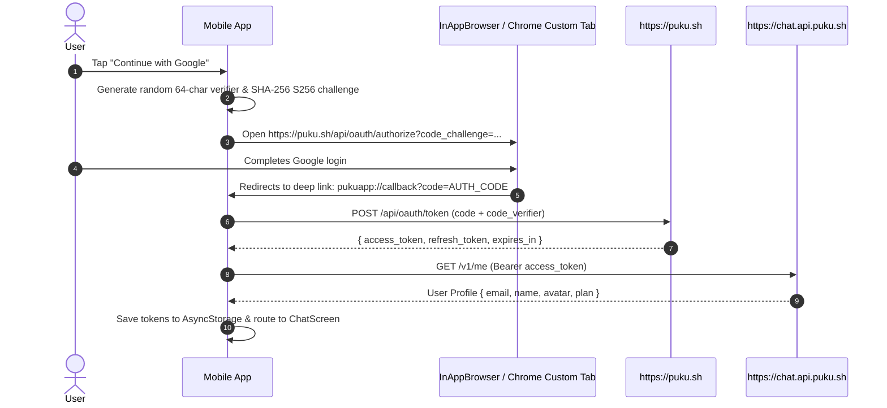

# Puku AI — API, Authentication & Remote Relay

This document details the backend endpoints, OAuth 2.0 PKCE authentication flow, session token storage, and desktop relay pairing protocol used by **Puku AI**.

---

## 1. Environment & Endpoints

Declared in `src/config/env.ts`:

| Key | Value | Purpose |
| :--- | :--- | :--- |
| `API_BASE_URL` | `https://chat.api.puku.sh` | Main chat streaming, conversations & projects API |
| `AUTH_BASE_URL` | `https://puku.sh` | OAuth 2.0 provider, email login & magic link |
| `AUTH_CLIENT_ID` | `puku-app` | Mobile OAuth Client Identifier |
| `AUTH_REDIRECT_URI` | `pukuapp://callback/` | Deep link scheme registered in Android & iOS |
| `REMOTE_SESSION_RELAY_HOST` | `https://puku-cli.relay.puku.sh` | WebSocket relay server for desktop CLI pairing |

---

## 2. Authentication Flow

Puku AI provides two primary authentication paths:

### Path A: Google OAuth 2.0 with PKCE (RFC 7636)

#### Manual Code Fallback
If the device browser or OEM restricts custom tab deep link redirection, the in-app Google Sign-In modal provides an explicit fallback input where users can paste the authorization callback URL or code directly to complete verification.

---

### Path B: Direct Email / Password & Bearer Token

For enterprise users or automated workflows:
1. Users can input their email and account password.
2. Users can paste an authentic Puku JWT Bearer token directly.
3. The app decodes JWT payloads (`email`, `sub`, `exp`) and verifies permissions against `/v1/me`.

---

## 3. Token Manager (`src/services/tokenManager.ts`)

- **Secure Storage**: Caches `accessToken`, `refreshToken`, and expiry timestamp in `@react-native-async-storage/async-storage`.
- **Automatic Header Injection**: Attaches `Authorization: Bearer <token>` to all HTTP requests via `pukuApi`.
- **Session Auto-Validation**: On cold boot, checks token validity; if valid, skips the login screen and opens the workspace immediately.

---

## 4. Desktop Remote Session Relay Protocol

Puku AI can pair with a developer's desktop command-line environment (`puku-cli`):

1. **Connection**:
   - The user inputs the `Relay Session ID` (e.g. `puku-relay-xxxx`) and `Session Token` (e.g. `tk_live_xxxx`).
   - The app establishes an authenticated connection to `https://puku-cli.relay.puku.sh`.
2. **Tool Execution Confirmation**:
   - When the remote AI agent proposes terminal commands or edits on the developer's computer, the mobile app receives an actionable prompt.
   - The user can inspect the proposed command/diff and tap **Approve** or **Reject** directly from the phone.
