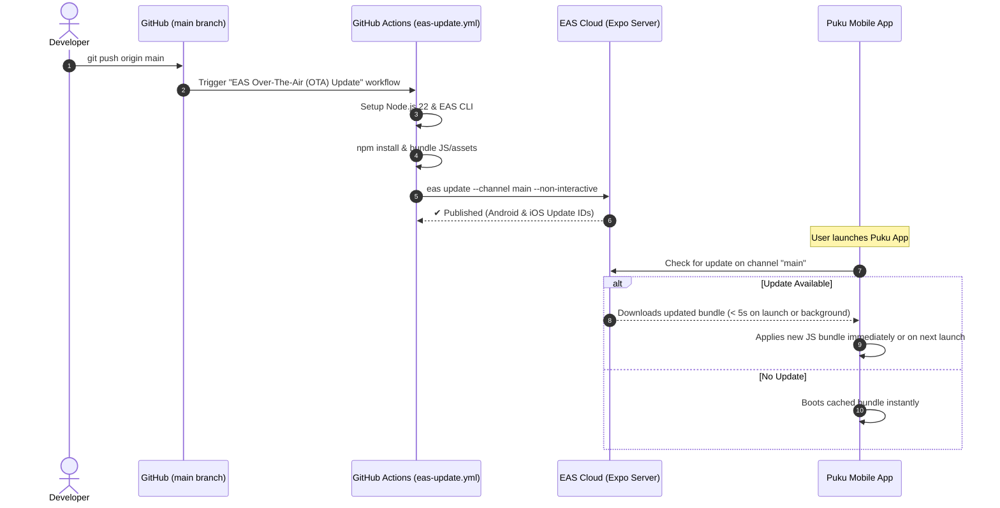

# Puku AI — Over-The-Air (OTA) Updates & CI/CD Pipeline

Puku AI uses **Expo Application Services (EAS) Updates** to deliver instant, zero-downtime JavaScript and asset updates directly to user devices without requiring a full APK re-installation or Google Play / App Store review.

---

## 1. How It Works



---

## 2. Configuration Details

### `app.json`
```json
{
  "expo": {
    "name": "Puku AI",
    "slug": "puku-ai",
    "owner": "iftakhar-alam",
    "version": "1.0.0",
    "runtimeVersion": "1.0.0",
    "updates": {
      "enabled": true,
      "checkAutomatically": "ON_LOAD",
      "fallbackToCacheTimeout": 5000,
      "url": "https://u.expo.dev/4b79ef0a-57a2-4e38-8e45-a7faa9589749",
      "channel": "main"
    },
    "extra": {
      "eas": {
        "projectId": "4b79ef0a-57a2-4e38-8e45-a7faa9589749"
      }
    }
  }
}
```

- **`checkAutomatically: "ON_LOAD"`**: Tells the native app to check the EAS update endpoint whenever the application starts.
- **`fallbackToCacheTimeout: 5000`**: Gives up to 5 seconds for a newly published update to download on cold boot. If network is slow, it immediately falls back to the cached bundle and downloads the update in the background for the subsequent launch.
- **`channel: "main"`**: Points all production builds to the `main` distribution channel.
- **`runtimeVersion: "1.0.0"`**: Ensures only compatible native builds receive the OTA bundle. If native dependencies (e.g. Kotlin, Objective-C, C++) change, bump `runtimeVersion`.

### `android/app/src/main/AndroidManifest.xml`
The channel is also natively declared in the Android Manifest:
```xml
<meta-data android:name="expo.modules.updates.EXPO_UPDATES_CHECK_ON_LAUNCH" android:value="ALWAYS"/>
<meta-data android:name="expo.modules.updates.EXPO_UPDATES_LAUNCH_WAIT_MS" android:value="5000"/>
<meta-data android:name="expo.modules.updates.EXPO_UPDATE_URL" android:value="https://u.expo.dev/4b79ef0a-57a2-4e38-8e45-a7faa9589749"/>
<meta-data android:name="expo.modules.updates.EXPO_UPDATES_CHANNEL" android:value="main"/>
```

---

## 3. Automated GitHub Actions Workflow

Located in `.github/workflows/eas-update.yml`:

```yaml
name: EAS Over-The-Air (OTA) Update

on:
  workflow_dispatch:
  push:
    branches: [ main ]

jobs:
  update:
    name: Publish Instant App Update
    runs-on: ubuntu-latest
    steps:
      - uses: actions/checkout@v4
      - uses: actions/setup-node@v4
        with:
          node-version: 22
          cache: 'npm'
      - uses: expo/expo-github-action@v8
        with:
          eas-version: latest
          token: ${{ secrets.EXPO_TOKEN }}
      - run: npm ci || npm install
      - run: eas init --account iftakhar-alam --non-interactive || true
      - run: eas update --channel main --non-interactive --message "Automated OTA update from main"
```

Every push or pull-request merge to `main` automatically builds and deploys an OTA release within ~2 minutes.

---

## 4. Manual Publishing via CLI

To manually publish an update from your local terminal:

```bash
# 1. Ensure working directory is clean
git status

# 2. Publish to channel 'main'
npx eas update --channel main --message "Manual patch release"
```

---

## 5. Verification on Physical Devices

1. Make changes to the React Native TypeScript code (e.g., in `src/`).
2. Push changes to `main`.
3. Wait for the GitHub Action to finish (verify with `gh run list --workflow="eas-update.yml"`).
4. Launch the Puku AI app on your phone.
5. If the app was already open in the background, close it from the multitasking menu (swipe up) and re-open.
6. The updated features will load automatically!
